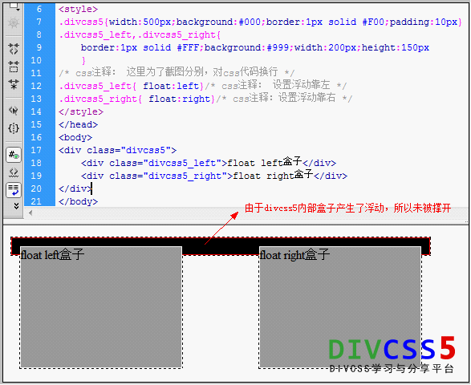
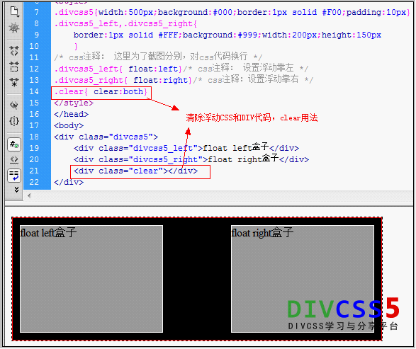

==Note: 学习笔记就在这里写，不同目录用 h2 + 分隔符分开==
==Front end only==

## baidu stylus

#### 对百度搜索结果做出一些修改

#### 特性

- 删除了广告
- 删除了container-left
- 居中显示搜索结果
- 加宽了搜索结果显示
- 导航栏居中，并且小改一下
- 删除了footer

添加了

- 每个搜索结果的container 添加了hover效果，增进交互。
- 移除了字体下划线，增强阅读性。
- 增加AD block  感谢作者pan_cao

## 更新

> 更新20171219 借鉴百度轻主题作者：pan\_cao，主要更新了界面的显示效果，搜索效果还是使用居中

----


## T1

- 給父类加CSS样式 overflow:hidden 就可以清除浮动 -margin 0 auto 就可以让元素居中显示
- 现在问题是如何让两个div在 .container 下左右个占一边呢？
  - 我记得有一种叫做Colum的方法但我就是想不起来了，现在问题是如何自己造一个 Colum
- 现在就按照最简单的和模型来吧
- clear:both 这个我之前一直都没有注意到，一个盒子内部有两个小盒子，小盒子分别左右浮动，由于浮动所以大盒子高度限制无法撑开，这时候就需要再这两个小盒子下创建一个清除浮动的类。





----

## T3

#### 实战网格布局

#### 问题记录

1. VScode css无法向外引用库 reset.css必须在本文件夹？
2. grid布局在大方向上，比如说整体框架上做布局结构，小结构并不合适，代码量反而会增多。

> 所以我认为结合grid和Flex最好。

参考实例：


----


## T7

### 几种高阶ES方式

```javascript
const companies = [
  { name: "Company One"， category: "Finance"， start: 1981， end: 2003 }，
  { name: "Company Two"， category: "Retail"， start: 1992， end: 2008 }，
  { name: "Company Three"， category: "Auto"， start: 1999， end: 2007 }，
  { name: "Company Four"， category: "Retail"， start: 1989， end: 2010 }，
  { name: "Company Five"， category: "Technology"， start: 2009， end: 2014 }，
  { name: "Company Six"， category: "Finance"， start: 1987， end: 2010 }，
  { name: "Company Seven"， category: "Auto"， start: 1986， end: 1996 }，
  { name: "Company Eight"， category: "Technology"， start: 2011， end: 2016 }，
  { name: "Company Nine"， category: "Retail"， start: 1981， end: 1989 }
];
const ages = [10， 20， 33， 12， 45， 32， 55， 22， 11， 7， 65， 34];

// forEach 与 map 相似 但是却不同

let mapAge = ages.map(e=>e*2)   // 返回结果 [ 20, 40, 66, 24, 90, 64, 110, 44, 22, 14, 130, 68 ]
let eachAge = ages.forEach(e=>e*2)  // 返回结果 undefined
但是两个方法都可以 loop through 数组内的元素


//
// ─── FOREACH ────────────────────────────────────────────────────────────────────
// 对于数组来说以后不要再写 for loop 了
companies.forEach((e， i) => {
   console.log(i， e.directors);
});

//
// ─── FILL ───────────────────────────────────────────────────────────────────────
//  修改原来数组,而不会返回新的数组

ages.fill(0)  // [ 0, 0, 0, 0, 0, 0, 0, 0, 0, 0, 0, 0 ] 
ages.fill(e=>Math.floor(Math.random()*10))  // fill 不是这么玩的 。。。 

let arr = new Array(100)
let vals = arr.fill(0).map(()=>Math.random())  // 新数组需要新填入数字 map 才可以映射


//
// ─── FILTER ─────────────────────────────────────────────────────────────────────
// filter 的回调函数决定了你如何操作数组
// old way
let canDrink = [];
for(let i=0;i<ages.length;i++){ // for loop
   if(ages[i]>=18) canDrink.push(ages[i])
}
console.log(canDrink)
// new way
const canDrink = ages.filter(age => age >= 18);
console.log(canDrink);

//ES5
const retailCompanyies = companies.filter(function(company){
   if(company.category === 'Retail') return true
 })
console.log(retailCompanyies)
//ES6
const retailCompanyies = companies.filter(company => company.category == "Retail");

// get 80's
const eightiesCompany = companies.filter(company => company.start > 1980 && company.start < 1990);
// lasted 10 years of more
const lastedTenYears = companies.filter(company => company.end - company.start >= 10);

//
// ─── MAP ────────────────────────────────────────────────────────────────────────
// 不同于 filter ， Map 其实可以创建数组 ， Map return 一个新的数组
// create arr of company names
const companyNames = companies.map(company => company.name);
// 开平方根
const ageSquare = ages.map(age => Math.sqrt(age)).map(age => age * 2);
console.log(ageSquare)
//
// ─── SORT ───────────────────────────────────────────────────────────────────────
// 每次比对两个元素 ， 返回 1 或者 -1
const sortedCompanies = companies
   .sort(function(c1， c2) {
     if (c1.start > c2.start) return 1; // A > B 返回 1
     return -1; // A < B 返回 -1
   })
  .map(e => e.start);
// 若 a 小于 b，即 a - b 小于零，则返回一个小于零的值，数组将按照升序排列。
// 若 a 等于 b，则返回 0。
// 若 a 大于 b， 即 a - b 大于零，则返回一个大于零的值，数组将按照降序排列。
const sortedCompanies = companies.sort((c1，c2)=>c1.start-c2.start).map(e=>e.start)
const soredAges = ages.sort((a，b)=>a-b)
console.log(soredAges);

//
// ─── REDUCE ─────────────────────────────────────────────────────────────────────
// reduce 冗余 ?
// old way
let ageSum = 0
for(let i=0;i<ages.length;i++){
  ageSum+=ages[i]
}
//new way
let ageSum = ages.reduce((total， age) => total + age， 0); // total 第一次取值 = 0
accmulator   是第一个指针
currentValue 一次一次向后移动
acc 10   计数器
curr 20  当前值
acc 30   计数器 10+20
curr 33  当前值 向后移 ···
acc 63
curr 12
acc 75
curr 45
acc 120
curr 32
acc 152
curr 55
acc 207
curr 22
acc 229
curr 11
acc 240
curr 7
acc 247
curr 65
acc 312
curr 34
// 获取所有公司年月累加和 这里就可以很好解释为什么需要你添加 0 这个第二参数
let allComYear1 = companies.reduce((total， company) => total + (company.end - company.start)); //返回值 [object Object]168215231058
let allComYear2 = companies.reduce((total， company) => total + (company.end - company.start)，0); // 118 
console.log(allComYear2);
```

### 异步

```javascript
function getPosts() {
  setTimeout(() => {
    let output = "";
    posts.forEach((e， i) => {
      output += `<li>${e.title}</li>`;
    });
    document.body.innerHTML = output;
  }， 1000);
}
function createPost(post) {
  return new Promise((res， rej) => {
    setTimeout(() => {
      posts.push(post);
      const error = false;
      if (!error) {
        res()
      } else {
        rej('Ops! Something went wrong')
      }
    }， 2000);
  });
}
let data = {
  title: "title 3"，
  body: "lorem ipsum"
};
// 一般情况下直接去跑这两个函数由于create函数延时更长导致getPosts提前在提交数据前就显示了数据
// 但是如果异步请求的话
async function init(){
  await createPost(data); //下面的函数等我创建完再跑
  getPosts();
}
```

### 关于 var let const

1. 作用域 
   1. var :  function scope
   2. let and const :  bracket scope
2. var 变量提升的问题
3. let / const

```javascript
function init(){
    按理来说 console.log(i) 是得不到什么东西 并且浏览器会想你抛出来一只狗
    for(var i=0;i<10;i++){
        // something ```
    }
    但是再这里 console.log(i) 你才能够得到东西 i = 10 
}
但是 实际上由于变量提升到函数域，以上等价于下面写法
function init(){
    var i;
    for(i=0;i<10;i++){}
} 
//当使用 var 去定义变量的时候， 编译器会自动把变量提升到函数下， 这样会导致重用这个变量时候报错，或者出现别的奇奇怪怪的问题。
function con(){
    for(let i=0;i<10;i++){}
    console.log(i)  // 这里就会报错，任何块级作用域以外都无法访问
    const a;  // 这样会报错，常量在定义的时候就必须确定值
    const obj = {x:100,y:200}  // 然后当你重新覆盖的时候
    const obj = 'hello'  // 此时会报错 但是
    obj.z=300;  // 此时对常量扩充是允许的，毕竟我没有重写常量
}


```

### 箭头函数 `=>`

```javascript
// ES5
function(){
    /····/
    return /···/
}
// ES6  小括号，花括号，return 可选，并且 其实自带return
()=>{
    
}
```

